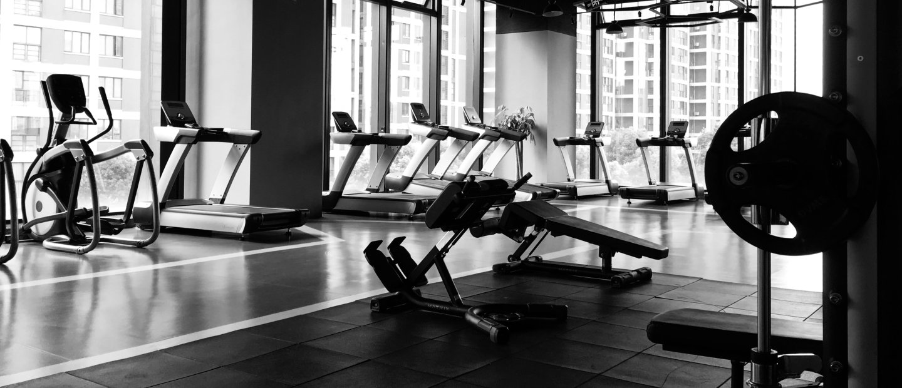

# How to Choose the Right Gym for You: 5 Major Factors To Consider

Are you planning to join a gym but don't know where to start? Choosing the right gym can be overwhelming, especially with so many options available.

However, it's important to find a gym that suits your fitness goals and lifestyle. While it may seem that many gyms are created equally, they may have some differences that could hurt your progression toward your fitness goals.

In this blog post, we'll discuss the 5 major factors to consider when choosing the right gym for you.

### **Goals** 

The most important factor to consider, that will also influence the other factors, are your fitness goals. This can help you make a more informed decision, since it can help you choose which gym matches most with your wants and needs.

If you haven’t already, it can really help to write down what your goals may be. Make sure to get as detailed as possible, looking beyond just the gains you want to achieve, but also details such as the time frame, the way in which you want to reach this goal, and how you can track this goal. Additionally, using the SMART (Specific, Measurable, Attainable, Relevant, Timely) goal framework can help make sure your goals are effective and reasonable. These details can make it easy to pick which sort of gym is best for you, and can even speed up your progress.

Your goals will come in handy while looking at the other factors, as they’ll help you figure out if these factors are well aligned for what you ultimately want to get out of the gym and the experience.

### **Location** 

Next, we have to consider the location of the gym. This is pretty straightforward, and mainly involves both the proximity of the gym to you and the location of where the gym is. You want a gym that is convenient for you to access, whether it's close to your home or workplace. If the gym is too far away, you may find it difficult to stick to your fitness routine. A gym that is close by makes it easy for you to pop in for a quick workout, even on a busy day.

Additionally, a gym that is in an area that you’re not fond of could make it difficult to stick to over time.

Finally, when selecting a gym based on location, also consider the parking facilities. Is there ample parking available, especially during peak hours? Is there public transportation available nearby? These questions can help you determine if the gym's location is convenient for you.

### **Facilities** 

The second factor to consider when choosing the right gym is the facilities. Take a tour of the gym and see what equipment they have. Do they have a variety of cardio machines, resistance machines, free weights, and functional training equipment? Do they have a pool, sauna, or steam room? These facilities can make your gym experience more enjoyable and help you achieve your fitness goals. If the gym doesn’t have the right facilities for your goals, then it may not be the best fit for you. This is when goals really comes in handy, as they can help guide this factor.

Aside from the equipment, you should also consider the[ cleanliness and maintenance of the gym](https://denver.gym2gym.com/why-private-gyms-are-more-hygienic-for-your-fitness-journey). Are the machines and facilities well-maintained and in good condition? Is the gym clean and well-kept? It can also help to speak to staff about their cleaning procedures and routines.

### **Quality of Trainers** 

The third factor to consider when choosing the right gym is the quality of trainers.[ Good trainers](https://denver.gym2gym.com/3-tips-for-finding-the-perfect-private-trainer-for-you) can help you get the most out of your gym experience and help you achieve your fitness goals faster. Look for a gym that has experienced and certified trainers who have a good track record of working with clients. You can also ask for a trial session with a trainer to see if their style and expertise match your fitness goals.

In addition to having qualified trainers, consider the availability of trainers. Are they available during the hours you plan to visit the gym? Do they offer personal training sessions or group classes? If you plan on using the trainers at your gym, make sure to consider whether they actually fit your fitness goals. Do they specialize in the types of workouts you’d want to be doing? If not, maybe its time to consider other gyms.

### **Cost** 

The fourth and final factor to consider when choosing the right gym is the cost. Gyms can have varying membership fees, so it's important to choose a gym that fits your budget. Some gyms offer discounts for students, seniors, or military personnel. Look for a gym that offers flexible membership options and payment plans. Remember, the most expensive gym doesn't always mean the best gym.

When considering the cost, also think about the value you are getting for your money. Does the gym offer additional amenities, such as towel service, lockers, or complimentary fitness classes? These amenities can add value to your gym membership and make it a more worthwhile investment.

### **Final Thoughts** 

In conclusion, choosing the right gym requires careful consideration of several factors. You want a gym that is convenient, well-equipped, has experienced trainers, fits your budget, and finally meets your fitness goals. By carefully considering these factors, you can ultimately improve your fitness progression, and reach your fitness goals faster while still enjoying your workouts.

Remember, joining a gym is just the first step. Sticking to your fitness routine and making exercise a habit is key to achieving your fitness goals. So, choose a gym that you enjoy going to and that motivates you to keep going. Happy gym hunting!
