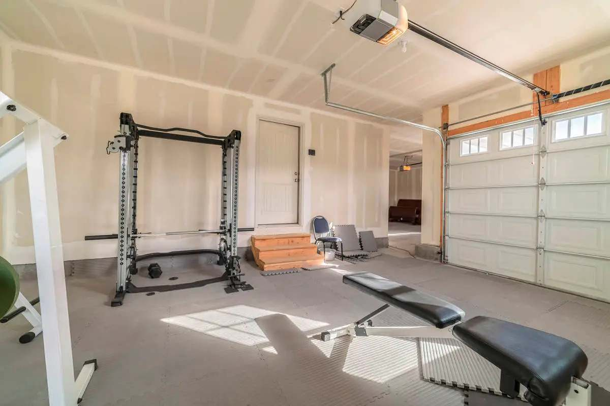
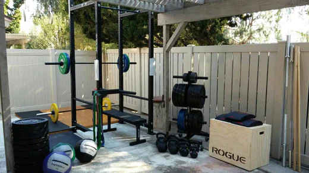
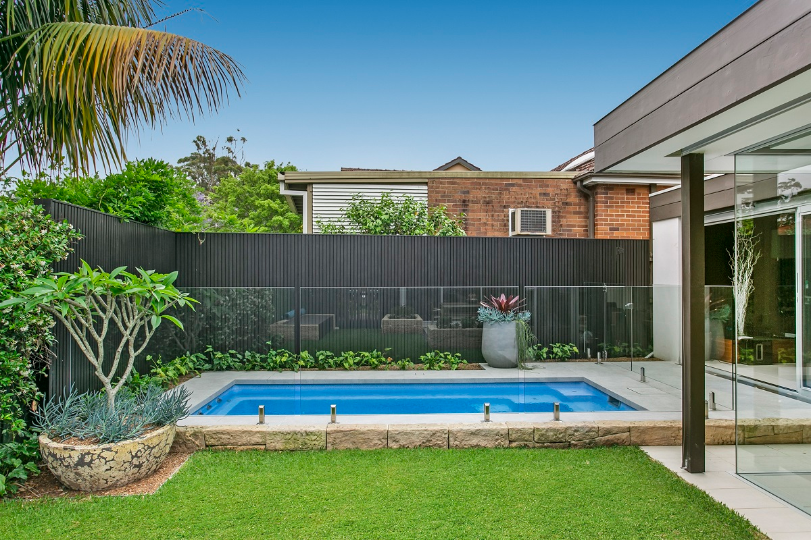

# Personal Home Gyms: Surprising ways to transform your home

Are you tired of paying for a gym membership that you barely use and spending precious time commuting back and forth? Then it's time to consider creating your own home gym! With the right placement, you can transform any living space into a personal fitness oasis. In this blog post, we will explore some amazing home gym placement ideas that will inspire you to take your fitness goals to the next level.

### **Convert Your Garage** 

If you're tight on space inside your home, consider converting your garage into a home gym. This is a fantastic option for those who want to create a separate fitness area without sacrificing living space. You can install mats, add some mirrors, and move in some equipment easily into the garage. Even if you don’t want to put up too much upfront investment, you can easily just put in some weights and a mat to get started! Plus, you can easily open the garage door to let in fresh air and natural light during your workouts.

<figure><figcaption></figcaption></figure>

Making a home gym in your garage gives you a perfect opportunity to also let others use it as their private gym, since it would most likely be separated from the rest of your house. Using platforms like[ Gym2Gym](https://www.notion.so/Gym2Gym-9ff496efcdb244948ef63defe269e672) lets you[ rent out the space to other gym enthusiasts](https://denver.gym2gym.com/profit-from-your-private-gym-how-to-monetize-a-fitness-space) looking for a private area to workout. Make your investment back, and gain a new side income, with the click of a button!

### **Make Use of Underutilized Spaces** 

Another great home gym placement idea is to make use of underutilized spaces in your home. For example, you can transform a corner of your living room or bedroom into a mini home gym by adding a few key pieces of equipment, such as a yoga mat, resistance bands, and dumbbells. This is a great way to incorporate fitness into your daily routine without taking up too much space.

With this placement, you can make the most of the space you already have. You can use a folding screen to create a separate area for your workout, or even add some plants to create a more relaxing atmosphere. You can also use your furniture to your advantage, such as using a sturdy coffee table as a bench for your exercises. This will most likely be the most convenient and affordable option, as you can use the things around you to get your workout in. However, make sure to clean often, since sweat can spread germs and bacteria easily!

### **Create an outdoor home gym** 

If you have a backyard or outdoor space, a great idea to consider is creating an outdoor gym. Not only can it provide a refreshing change of pace from your typical indoor gym routine, but it can also offer a unique and invigorating environment to work out in. By setting up a variety of equipment such as pull-up bars, free weights, etc., you can give yourself a challenging and diverse workout experience. Alternatively, you can utilize your body weight for exercises like push-ups and squats to target specific muscle groups.

The benefits of an outdoor gym extend beyond just the physical aspect. Exercising outdoors can also have a positive effect on your mental health by reducing stress and anxiety, while getting sunlight. Furthermore, getting some sun exposure can help boost your Vitamin D levels, which is essential for bone health and other bodily functions. Overall, creating an outdoor gym can be a fantastic way to enhance your fitness routine and enjoy the great outdoors at the same time.

### **Add a swimming pool** 

If you have the budget and space, you may want to consider adding a swimming pool to your home gym. Swimming is an excellent form of low-impact exercise that works out almost all the muscles in your body. With a swimming pool in your home gym, you can enjoy a refreshing dip after a workout or on hot summer days. You can also use it to mix up your exercise routine, as there are many different swimming techniques you can try to work out different muscle groups.

Moreover, swimming is a great way to improve your cardiovascular endurance and lung capacity. By swimming regularly, you can increase your stamina and boost your overall fitness level. Additionally, a swimming pool can be a great place to relax and unwind after a long day at work or school. You can float on your back and gaze up at the sky, or listen to music while you swim laps. Finally, having a swimming pool in your home gym can also add value to your property, making it a smart investment for the future.

### **Conclusion** 

Creating a home gym is a fantastic way to stay fit and healthy without having to leave the comfort of your own home. With these amazing home gym placement ideas, you can transform any living space into a personal fitness oasis. Whether you centralize your workout equipment in a spare room, convert your garage, make use of underutilized spaces, create an outdoor gym or add a swimming pool, there are countless ways to create a home gym that suits your needs and preferences.

The most important thing is to choose a placement that works for you and your lifestyle. Consider your available space, budget, and fitness goals when deciding on the perfect placement for your home gym. So, what are you waiting for? Start transforming your living space today and take your fitness goals to the next level!
